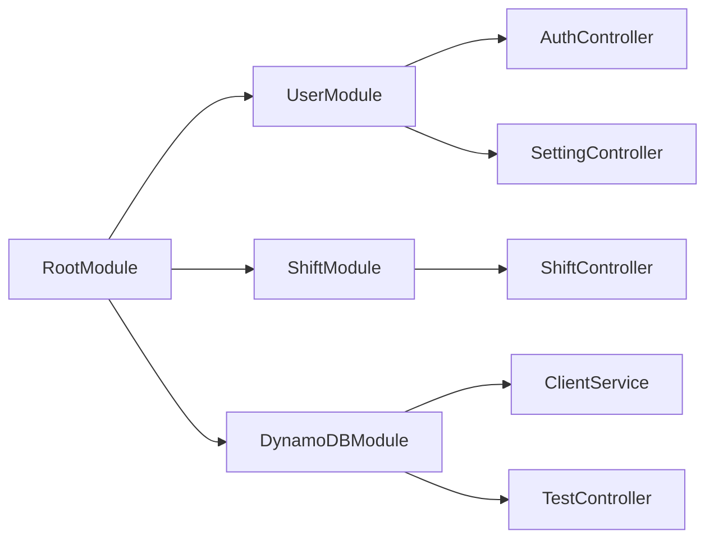

# dynamoDB の設計

## Users

- hashkey

  - id

- attribute

  - name(for login)
  - display_name
  - password
  - false_count
  - is_manager

## Shifts

- hashkey

  - id

- sortkey

  - date+partition(文字列として結合)

- attribute

  - user_id

