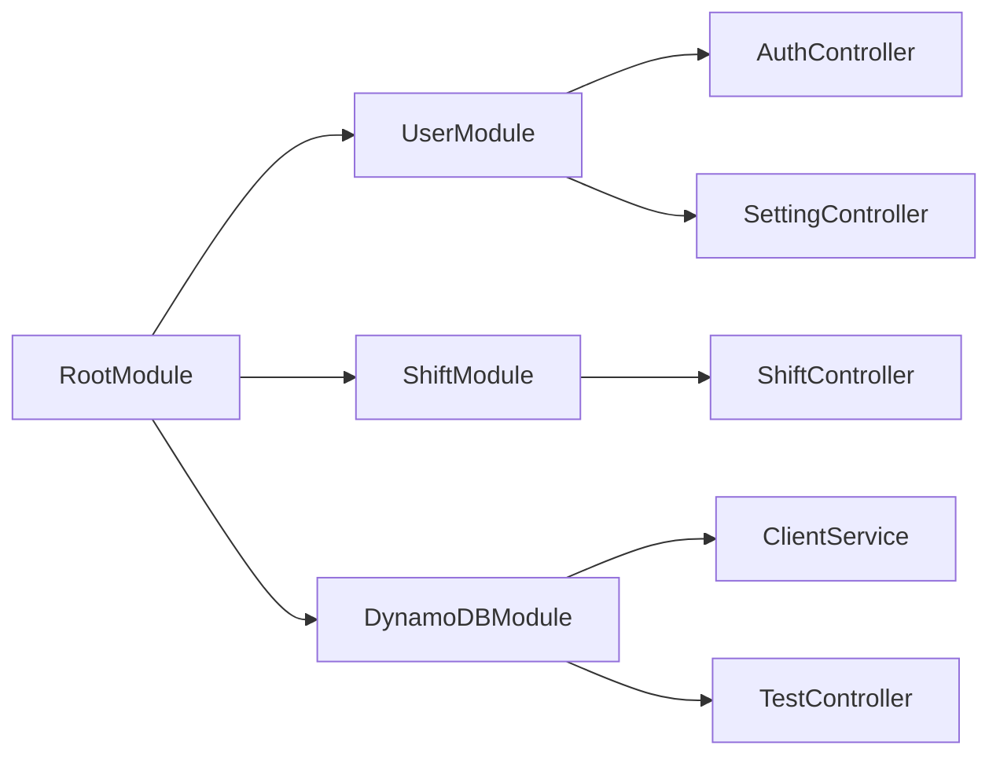

# Nestjs の設計

## Nestjs のファイル構成

- appModule(RootModule)
  - UsersModule
    - UsersController
      - UsersService
    - AuthController
      - AuthService
  - ShiftsModule
    - ShiftsController
      - ShiftsService
  - DynamoDBModule
    - ClientService

