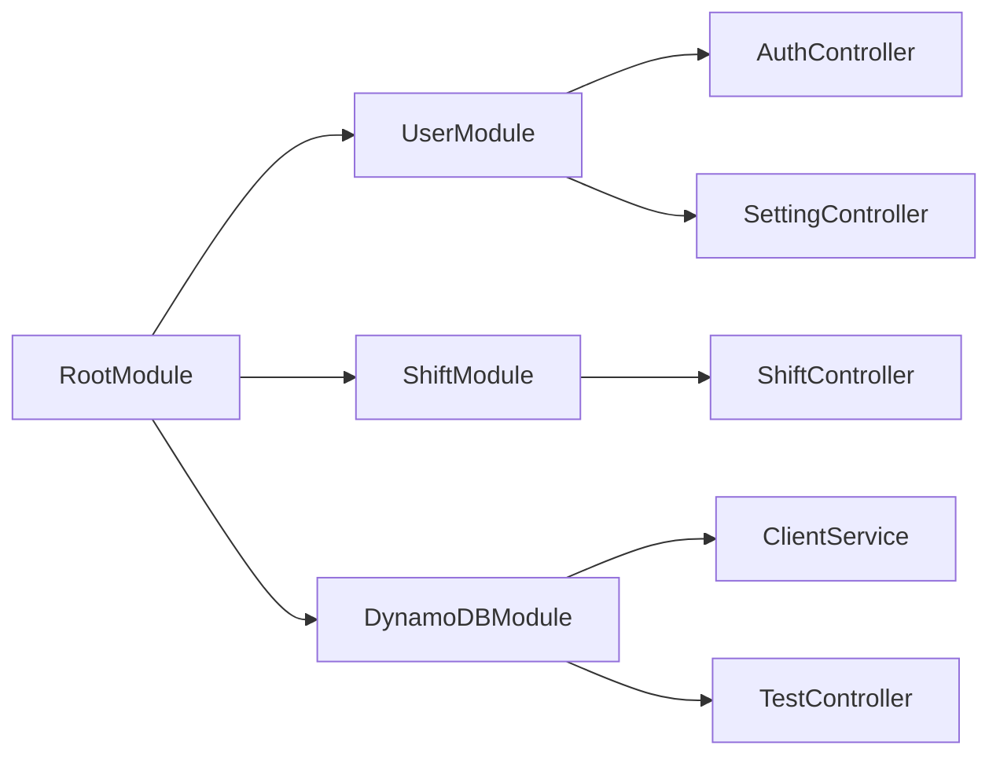

# Nestjs の設計

```mermaid

graph LR

    A[RootModule] --> B[UserModule]
    A --> C[ShiftModule]
    A --> D[DynamoDBModule]
    B --> E[AuthController]
    B --> F[SettingController]
    C --> G[ShiftController]
    D --> H[ClientService]
    D --> I[TestController]

```
